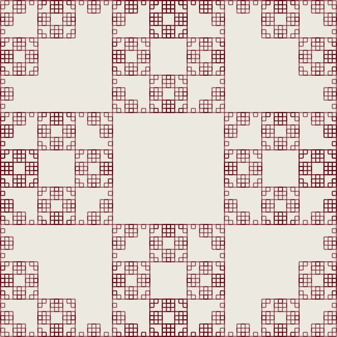
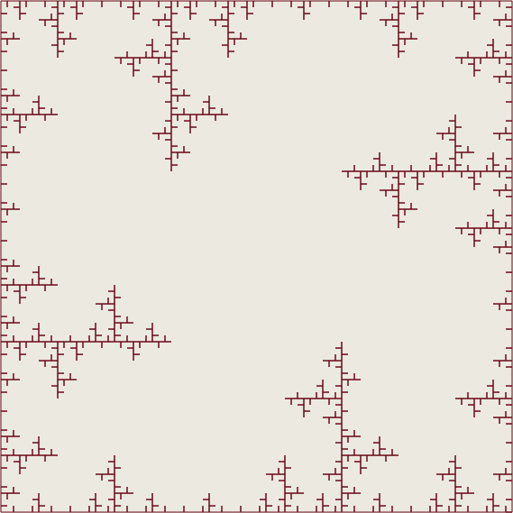
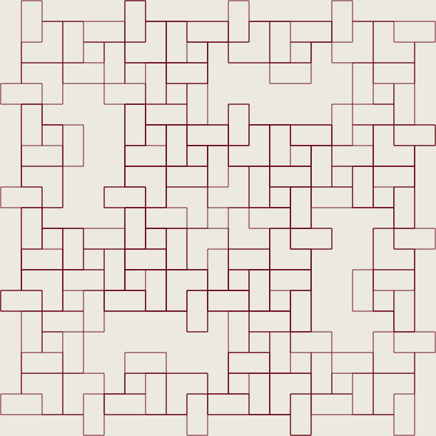
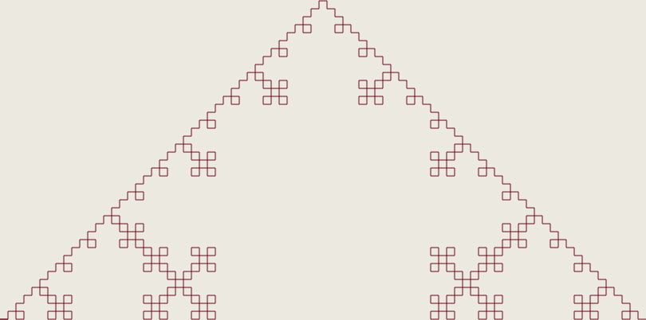

# L-Systems

This an implementation of some [L-systems](https://en.wikipedia.org/wiki/L-system).

All system are from the chapter ['Graphical modeling using L-systems'](http://algorithmicbotany.org/papers/abop/abop-ch1.pdf) from [The Algorithmic Beauty of Plants](http://algorithmicbotany.org/papers/#abop) by Przemysław Prusinkiewicz && Aristid Lindenmayer.

The project is an extension of a [previous project](https://github.com/bergsans/l-system-node-js) using `node-canvas` and png files for output, instead of ASCII-renderings later transformed to png.

## Examples

